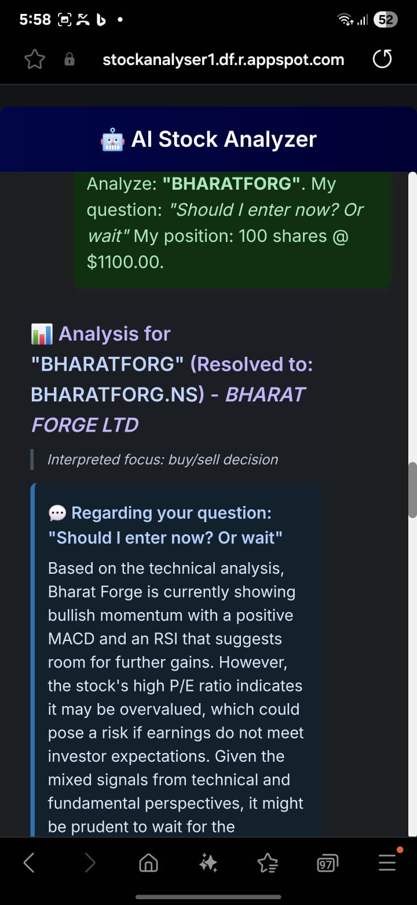
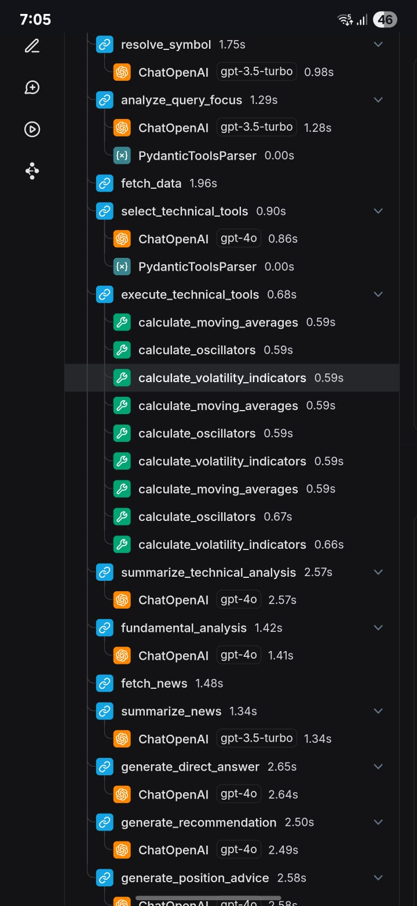

# AI Stock Analyzer Chat

## 🚀 Overview

The AI Stock Analyzer is an interactive web application that provides users with comprehensive stock analysis through a chat interface. Users can input a stock symbol or company name, ask specific questions, and optionally provide their current position details (shares and average price). The backend, built with FastAPI and LangGraph, processes the query, fetches relevant data (market data, fundamentals, news), performs analysis using Language Models (LLMs), and returns a structured response including technical summaries, fundamental insights, news analysis, direct answers to user questions, overall recommendations, and position-specific advice.

The frontend is a clean, responsive HTML page styled with Tailwind CSS, allowing users to easily interact with the analyzer.



*(Replace `analyzer_screenshot.png` with the actual path to your project's screenshot if available)*

## ✨ Features

* **Symbol Resolution**: Converts company names or partial symbols to official stock tickers (e.g., "Apple" to "AAPL", "Infosys" to "INFY.NS").
* **Multi-Source Data Fetching**:
    * **Market Data**: Fetches historical price data (daily, weekly, monthly) and company information primarily using `yfinance`.
    * **Alpha Vantage Fallback**: Uses Alpha Vantage as a fallback for market data if `yfinance` fails.
    * **News Aggregation**: Fetches relevant news articles for the specific stock and broader market using the Brave Search API.
* **Comprehensive Analysis**:
    * **Technical Analysis**: Calculates and summarizes key technical indicators (SMAs, EMAs, MACD, RSI, Bollinger Bands).
    * **Fundamental Analysis**: Summarizes key fundamental metrics (P/E, EPS, Market Cap, Sector, Industry, Business Summary).
    * **News Analysis**: Summarizes recent news, highlighting sentiment and potential market impact.
* **LLM-Powered Insights**:
    * **Query Focus Analysis**: Understands the intent behind user questions to tailor the analysis.
    * **Direct Question Answering**: Provides concise answers to specific user questions based on the gathered data and analysis.
    * **Overall Recommendation**: Generates a Buy/Sell/Hold recommendation with justifications based on TA, FA, and news.
    * **Position-Specific Advice**: Offers tailored advice if the user provides their current stock position.
* **Interactive Frontend**:
    * User-friendly chat interface built with HTML, Tailwind CSS, and vanilla JavaScript.
    * Responsive design for usability on desktop and mobile devices.
    * Clear presentation of analysis results in distinct, easy-to-read sections with icons.
    * "Share on WhatsApp" functionality to easily share analysis summaries.
    * Toggleable input form for a cleaner chat view.
* **Modular Backend**:
    * Built with FastAPI for robust API development.
    * Uses LangGraph to orchestrate the complex analysis workflow as a stateful graph.
    * Asynchronous operations for improved performance.
* **Configuration**: Uses environment variables for API keys and other settings.

## 🛠️ Tech Stack

* **Backend**:
    * Python 3.10+
    * FastAPI: For building the API.
    * Langchain & LangGraph: For orchestrating LLM calls and building the analysis workflow.
    * Langchain-OpenAI: For interacting with OpenAI LLMs (GPT-4o, GPT-3.5-turbo).
    * `yfinance`: For fetching stock market data.
    * `alpha_vantage`: For fallback stock data.
    * `httpx`: For making asynchronous API calls to the Brave Search API.
    * `pandas`, `numpy`, `ta`: For data manipulation and technical indicator calculations.
    * `uvicorn`: ASGI server for FastAPI.
    * `python-dotenv`: For managing environment variables.
* **Frontend**:
    * HTML5
    * Tailwind CSS: For styling.
    * Vanilla JavaScript: For interactivity and API communication.
* **APIs Used**:
    * OpenAI API
    * Brave Search API (for news)
    * Alpha Vantage API (optional, for stock data fallback)

## ⚙️ Setup & Running the Application

1.  **Clone the Repository** (Assuming you have one)
    ```bash
    git clone <your-repository-url>
    cd <repository-directory>
    ```

2.  **Create a Virtual Environment** (Recommended)
    ```bash
    python -m venv venv
    source venv/bin/activate  # On Windows: venv\Scripts\activate
    ```

3.  **Install Dependencies**:
    Navigate to the `backend` directory (or wherever your `requirements.txt` is located).
    ```bash
    pip install -r requirements.txt
    ```

4.  **Set Up Environment Variables**:
    Create a `.env` file in the `backend` directory (or the root, depending on your `load_dotenv()` path in `stock_analyzer.py`). Add the following variables:
    ```env
    OPENAI_API_KEY="your_openai_api_key"
    BRAVE_SEARCH_API_KEY="your_brave_search_api_key"
    ALPHAVANTAGE_API_KEY="your_alpha_vantage_api_key" # Can be "demo" for limited use or your own key

    # Optional: For LangSmith Tracing
    # LANGSMITH_TRACING="true"
    # LANGSMITH_ENDPOINT="[https://api.smith.langchain.com](https://api.smith.langchain.com)"
    # LANGSMITH_API_KEY="your_langsmith_api_key"
    # LANGSMITH_PROJECT="Stock Analyzer Chat App Async" # Or your preferred project name
    ```

5.  **Run the Backend Server**:
    From the `backend` directory (where `main.py` is located):
    ```bash
    uvicorn main:app --reload --port 8000
    ```
    Or, if `main.py` is in a subdirectory like `backend/app`, adjust the command accordingly.

6.  **Access the Frontend**:
    Open your web browser and navigate to `http://localhost:8000/`. The `index.html` file should be served.

## 🌐 API Endpoint

* **`POST /analyze`**:
    * **Request Body**:
        ```json
        {
            "user_stock_query": "string (required, e.g., 'AAPL' or 'Apple')",
            "user_question": "string (optional, e.g., 'Is it a good buy?')",
            "user_position_shares": "float (optional, e.g., 100)",
            "user_position_avg_price": "float (optional, e.g., 150.75)"
        }
        ```
    * **Response Body**: (See `AnalysisResponse` Pydantic model in `main.py` for full structure)
        Includes resolved symbol, company name, summaries (TA, FA, News), direct answer, recommendation, position advice, and any error messages.

## 🔮 Future Enhancements

* **Chart Generation**: Implement dynamic chart generation (e.g., price charts with indicators) using a library like Matplotlib or Plotly, saved as images and served to the frontend. (Currently disabled).
* **User Accounts & History**: Allow users to create accounts and save their analysis history.
* **Watchlist Feature**: Enable users to create and track a watchlist of stocks.
* **Advanced Technical Indicators**: Add more sophisticated technical indicators and pattern recognition.
* **Deeper Fundamental Analysis**: Integrate more detailed financial statement analysis (income, balance sheet, cash flow).
* **Real-time Data**: Explore options for more real-time data updates (though this often requires paid APIs).
* **Enhanced News Sources**: Allow configuration of preferred news sources or use more specialized financial news APIs.
* **Sentiment Analysis Fine-tuning**: Improve the nuance of sentiment analysis for news and user queries.
* **Deployment**: Provide clear instructions for deploying to cloud platforms (e.g., Google App Engine, AWS, Azure).
* **Interactive Charts**: Use JavaScript charting libraries (e.g., Chart.js, D3.js, ECharts) for interactive charts on the frontend.

---

This README provides a comprehensive guide to understanding, setting up, and using the AI Stock Analyzer.


